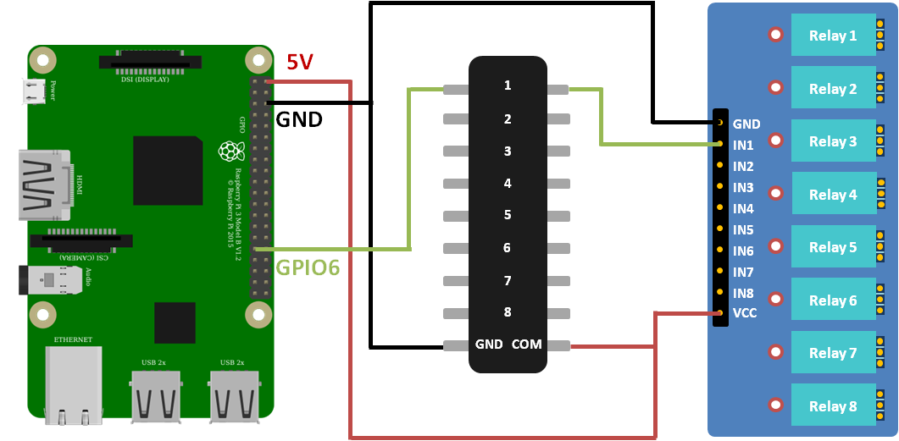
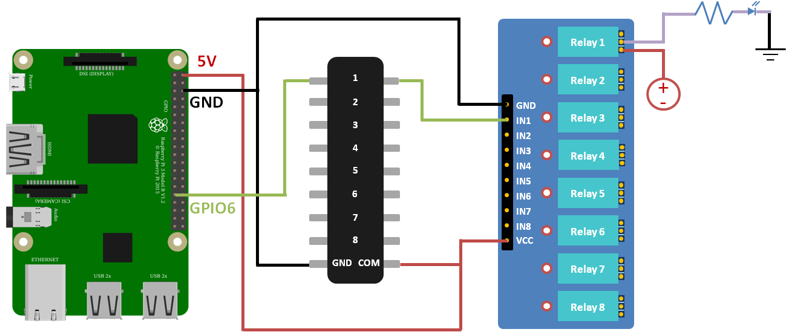
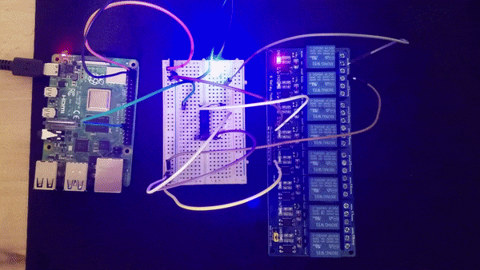

# Garden PI
A Raspberry Pi based gardening computer - built with rust.

This project is specific for my usecase, and doesn't try to be generic and work for many different configurations. It can, however, be used for inspiration and as a guide on how to create similiar solutions.

## Specs
The gardening computer is a **Raspberry PI 4B (2GB RAM)**, which drives **8 24VAC solenoid valves**.


## Goals
The main goal of the project is to (of-course) replace our old and failing gardening computer :wink:.
After that, in no particular order, are the following:
* Get my hands dirty with some electronics.
* Learn to write a web frontend and backend in Rust.
* Write a blog following this adventure (?).

## Overview
As I currently see it, the project can be split into three sub-projects:

1. Successfully wiring up the PI to the solenoids.  
This may seem trivial to the more electronically inclined of you, but for us simple programmers (or at least me), this is a pretty daunting task. 

2. Write a frontend website (in Rust!) that the PI will serve locally, allowing us to configure our gardening schedule.

3. Write a backend for the website, which will communicate with the frontend to control the PI's GPIO pins, and thus control the valves.

---

## Follow-along blog
During the project I will try to write down my thoughts here. Hopefully at the end, I can cobble them together into some blog post / web format.

### Wiring up the PI to the solenoid valves
The current gardening computer is driving 8 [Bermad solenoid valves](https://www.bermad.com/product/s-390-2w-2/), with the following specs:
* 24VAC 
* Inrush: 0.25A
* Hold: 0.125A

The PI can only output 5V at the maximum, with its GPIO pins at only 3.3V. This means that we need a relay to be able to trigger the valves.
After reading around, it seems that there are two types of relays that are relevant for this type of project:

1. Mechanical relay
2. Solid state relay

The type of relay you choose is important, as it affects the safety measures that you have to take to protect you PI.

Mechanical relays, while cheaper, internally use a coil which becomes magnetically charged. This has multiple downsides, of most concerning is the [Back EMF](https://www.embedded.com/back-emf-and-snubber/) which is released when the coil is discharged. This can have varying reprecussions, from reseting your PI, to frying you board, to even starting a fire!

Solid state relays, on the other hand, do not have this phenomenom, and thus can be used without additional safety measures.

Both types of relays, however, typically need 5V to trigger, while the PI's GPIO pins can only output 3.3V! When reading around the web, you can see many examples of people who directly connected their PI's to a 5V relay successfully, but it's very dependent on the specific relay / board used. Many cheap knockoffs will simply not work.  
To be able to consistently power your relay, the best thing to do is to use a transistor, which will pass power from the PI's 5V pin, and will be triggered by the GPIO one.

As we need to power 8 different valves, we need an 8-channel relay board, as well as 8 transistors. To simplify the amount of electronic fiddling we need to do, we can simply use a transistor array, such as [ULN2803](https://www.theengineeringprojects.com/2018/10/introduction-to-uln2803.html), which as a bonus also protects our GPIO pins from kickback voltage!
As we have this protection, we can use an 8-channel mechanical relay, specifically [ARE00108SL](https://rlx.sk/en/various-boards/3321-8-channel-relay-module-10a-er-are00108sl.html), which is locally available (Israel).

Finally, we need a 24VAC transformer to provide power to our valves.

**Safety Issues!**  
> * The relay board will be powered using the 5V output of the PI, which has a maximum output current of 500mA. As each [individual relay](https://datasheetspdf.com/pdf-file/720556/Songle/SRD-05VDC-SL-C/1) draw about 72mA, this means we **can't** power all of them on at the same time.  
> In practice, this limitation is not very meaningful as our 24VAC transformer can only safely turn on 4 valves at once (6 sustained), so we will need to be very careful when writing the software to forbid drawing too much current.24VACj
>
> * At first I thought that the PI's GPIO pins need to be connected to the ULN2803 using a resistor, but looking at the [diagram](https://www.ti.com/lit/ds/symlink/uln2803a.pdf?ts=1597840871187&ref_url=https%253A%252F%252Fwww.google.com%252F), it seems that transitor is protected by a **2.7kΩ** resistor, which means that we can connect it directly.

## Checking the parts

So we did the homework and ordered and received the parts. The first thing to do is to make sure that everything actually works!  

To do that, we first create a simple circuit using only the PI, the darlington array and the relay board: 



As you can see, the relay board comes with handy debugging leds for each relay, which turn on when the corrensponding IN[X] pin is set.
We the run the following simple python script:

```py
import sys
import time
import gpiozero

RELAY_PIN = 6

relay = gpiozero.OutputDevice(RELAY_PIN, active_high=True, initial_value=False)

def set_relay(status):
    if status:
        print("Setting relay: ON")
        relay.on()
    else:
        print("Setting relay: OFF")
        relay.off()

def main_loop():
    while 1:
        set_relay(False)
        time.sleep(1)
        set_relay(True)
        time.sleep(1)


if __name__ == "__main__":
    try:
        main_loop()
    except KeyboardInterrupt:
        # turn the relay off
        set_relay(False)
        print("\nExiting application\n")
        # exit the application
        sys.exit(0)
```

This script simply turns the relay on and off. When the relay is toggled, there is an audible "click" sound, and we see the LED turn on and off:


Cool!

The next test is to make sure that I actually understand how to connect anything to the relays.
Each relay has three pins, and which pins you choose affects if the relay opens or closes your circuit.

Lets add a simple led to the previous circuit and try to make it shine when the relay is triggered:



As you can see, I opted to use the second and third connections on the relay, which according to the schematic was the correct way to connect things so that the circiut closes only when the relay is triggered.

So now, whenever we trigger the relay, it closes the circuit for us:



This may seem like a small achievment, but it's basically everything we need on the electronic side of things for this project!
